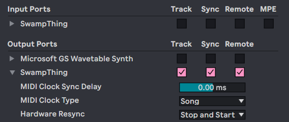

# **SwampThing**
Beginning of a standalone Juno-106 inspired DCO monosynth for UF AES. Built around Raspberry Pi Pico Microcontroller.

## **Project Status**
| Component         | Designed  | Prototyped  | PCB / Finalized |
| -----             | --------  | ----------- | --------------- |
| DCO Saw-core      | X         | X           |                 |
| DCO Pulse / PWM   | X         | X           |                 |
| DCO SUB           | X         |             |                 |
| Blend             | X         |             |                 |
| MIDI USB          | X         | X           |                 |
| MIDI DIN          | X         | X           |                 |
| VCF               | X         | X           |                 |
| EG                | X         | X           |                 |
| VCA               | X         | X           |                 |
| Power Solution    |           |             |                 |
| Output            |           |             |                 |

# Table of Contents
- [Installation / Build](#installation--build)
  - [Prereqs](#prereqs)
  - [Build Steps](#build-steps)
  - [Quick Build & Flash](#quick-build--flash)
  - [Manual Flashing](#manual-flashing)
  - [I/O Notes](#io-notes)
- [Architecture](#architecture)
  - [Component Diagram](#component-diagram)
  - [MIDI](#midi)
    - [USB MIDI](#usb-midi-implemented)
    - [DIN MIDI](#din-midi-planned)
  - [Digitally Controlled Oscillator (DCO)](#digitally-controlled-oscillator-dco)
    - [SAW](#saw)
    - [PULSE / PWM](#pulse--pwm)
    - [SUB OSC](#sub-osc)
    - [BLEND](#blend)
  - [Envelope Generator (EG)](#envelope-generator-eg)
  - [Voltage Controlled Amplifier (VCA)](#voltage-conrolled-amplifier-vca)
  - [Voltage Controlled Filter (VCF)](#voltage-controlled-filter-vcf)
  - [Power Solution](#power-solution)
- [Incomplete BOM](#incomplete-bom)

# Installation / Build
MIDI control, oscillator reset signals, charge voltage and envelope gates are derived from a Raspberry Pi Pico.

### Prereqs
- [VS Code](https://code.visualstudio.com/)
- [Raspberry Pi Pico VS Code Extension](https://marketplace.visualstudio.com/items?itemName=raspberry-pi.raspberry-pi-pico)

### Build Steps
1. Clone this repo
2. Open the `src` folder in VS Code (not the root folder!)
3. Open a PowerShell terminal in VS Code
4. Run:
```powershell
mkdir build
cd build
cmake -G "Ninja" ..
cmake --build .
```
5. The `.uf2` file will be in `build/SwampThing.uf2`

### Quick Build & Flash
- Press `Ctrl+Shift+B` to build and flash in one step - nifty!

### Manual Flashing
1. Hold BOOTSEL on your Pico and plug it in
2. Drag `SwampThing.uf2` onto the Pico drive

### I/O Notes:

| Function            | GPIO #     | 
| -----               | --------   | 
| Clock output        | 13         |
| CV output           | 14         |
| Gate output         | 12         |


# Architecture
## Component Diagram:


## MIDI:

### USB MIDI (Implemented)
SwampThing appears as a **class-compliant USB MIDI device** over the Pico’s micro-USB port using TinyUSB.




### DIN MIDI (Planned)

5-pin DIN MIDI IN (with opto-isolation and UART at 31.25 kbps) is planned. DIN and USB MIDI will eventually share the same internal note/gate handling.


## Digitally Controlled Oscillator (DCO):

### SAW
Juno-style ramp core. A TL074 op-amp integrator generates a rising ramp, NPN transistor reset discharges the timing capacitor at a rate set by the microcontroller clock. Pitch is set by the reset clock (GPIO 13). Ramp slope is set by a PWM-derived charge voltage filtered to DC (GPIO 14).

### PULSE / PWM
Saw --> Comparator, threshold = PWM

### SUB OSC
OSC --> Flip Flop, halves frequency

### BLEND
Blend control between saw and pwm

## Envelope Generator (EG):
*Currently In Development*

Design chosen

## Voltage Conrolled Amplifier (VCA):
*Currently In Development*

JFET implementation

## Voltage Controlled Filter (VCF):
*Currently In Development*

Based on Mortiz Klein / Erica Synths VCF

## Power Solution:
*Currently In Development*

 Presently planning +/- 12V, 5V rails.

# Incomplete BOM:

| PART              | QTY       | NOTE              |
| -----             | --------  | -----------       |
| Raspberry Pi Pico | 1         | Micrcontroller    |
| TL074             | 1         | 4x Op Amp         |
| 2N3904 NPN BJT    | 1         | Reset Transistor  |       
